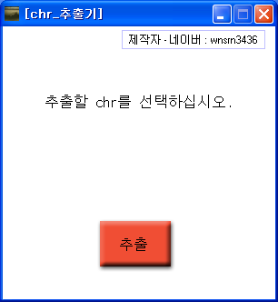

# Jurassic Primitive War 2 CHR Extractor

Jurassic Primitive War 2 keeps each unit's stats, graphics, sound and palette bundled together in a single CHR file. This is an extractor that pulls the resources inside a CHR out as separate files, based on an analysis of the header layout. It reads the counts and lengths from the header, so it adapts to the different makeup of each unit.

The analysis is written up in [docs/chr-format.md](docs/chr-format.md).

<p>
  
</p>


## How to use

Download from Releases, extract and run it, then press the extract button and a file dialog opens. Pick the `.chr` to extract, then choose where to save the results in the folder dialog that follows, and it takes it from there.

The output folder ends up like this.

| Path | Contents |
|---|---|
| `<name>.cei` | Unit stats |
| `spr/j00_m0.pnt` | Palette |
| `spr/*.spz` | Unit images, named by animation category |
| `sound/*.wav` | Unit sounds |

If a file of the same name already exists in the output folder, a new one is made with the next number.


## How it works

**One function reads any multi byte header field and is reused everywhere.** Given a position and a byte count, it reads that many bytes back to front and assembles them as little endian. The receiving variable is passed by name as a string and filled through `variable_local_set`. With more than twenty count fields scattered through the header, calling it one line at a time was the easy way.

```gml
// sk_load_data(variable name, position, file, byte count)
file_bin_seek(argument2, argument1)
for(v=argument3-1; v!=-1; v-=1)
{
  file_bin_seek(argument2, argument1+v)
  variable_local_set(argument0,
    variable_local_get(argument0) + sk_hex_conversion(file_bin_read_byte(argument2)))
}
variable_local_set(argument0, sk_dec_conversion(variable_local_get(argument0)))
```

```gml
sk_load_data("rmax", 8720, files, 4)   // total image count
sk_load_data("rmg",  8724, files, 4)   // guard
sk_load_data("rmm",  8728, files, 4)   // move
sk_load_data("rma",  8732, files, 4)   // attack
...
```

The offsets above are written in decimal in the source. They are the same values as the hex ones in the analysis ([docs/chr-format.md](docs/chr-format.md)).

**File names come from counting down the per animation totals.** The header does not record which sprite belongs to which action, only how many of each there are. The order is always the same though, so a function counts each total down one at a time and returns which action is current. That is how an extracted file comes out with an action name like `m0000.spz`.

```gml
// sk_spr_name()
if real(rmg)>0{rmg=string(real(rmg)-1); return "g"}
else if real(rmm)>0{rmm=string(real(rmm)-1); return "m"}
else if real(rma)>0{rma=string(real(rma)-1); return "a"}
...
```

**Extraction runs in stages driven by an alarm.** GameMaker freezes its window if one event runs for too long. So a `progress` variable splits the work into stages and each alarm tick advances one stage. That leaves room to redraw between stages, which is how status text like "spz추출중" ("extracting spz") can be shown.

| Stage | Work |
|---|---|
| 0 | Read every count field in the header |
| 1 | Cut out the fixed CEI and PNT regions |
| 2 | Pull out the SPZ files one by one |
| 3 | Pull out the WAV files one by one |
| 4 | On the last alarm, show the completion message and return to the start screen |

**SPZ and WAV entries vary in length, so each one's header is read again.** A little past the start of each entry sits its length. That value is read, that many bytes are cut out, and the cursor moves forward by the same amount to the next entry. This repeats until the count runs out.

```gml
while(real(rmax) > 0)
{
  sk_load_data("goto", susk+24, files, 4); goto = string(real(goto)+32)
  ...
  file_bin_seek(files, susk)
  repeat(real(goto)){ file_bin_write_byte(files2, file_bin_read_byte(files)) }
  susk += real(goto)
}
```


## Files

| Path | Contents |
|---|---|
| `source/jw2-chr-extractor.gmk` | Original project file |
| `source/split/` | Text tree produced by GmkSplitter |
| `docs/chr-format.md` | CHR header offset analysis |
| `docs/screenshots/` | Screenshots |
| Releases | Executable and usage notes |


## Credits

The Korean text scripts under `source/split/Scripts/한글드로우/` were written by 김게맛 (sodium031) of the GameMaker community.


## License

zlib. See [LICENSE](LICENSE). Bundled libraries made by other people keep their own licenses.
